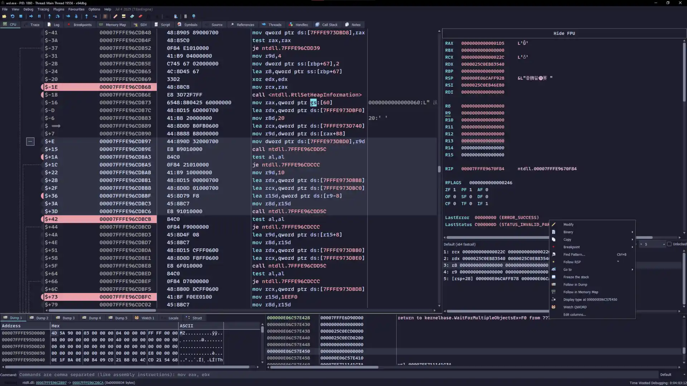

<h3 align="center">
	<br/>
	
	Catppuccin for <a href="https://x64dbg.com">Xdbg</a>
	
</h3>

<p align="center">
	<a href="https://github.com/catppuccin/xdbg"></a>
	<a href="https://github.com/catppuccin/xdbg/issues"></a>
	<a href="https://github.com/catppuccin/xdbg/contributors"></a>
</p>

<p align="center">
	
</p>

## Previews

<details>
<summary>🌻 Latte</summary>

</details>
<details>
<summary>🍀 Frappé</summary>

</details>
<details>
<summary>🌺 Macchiato</summary>

</details>
<details>
<summary>🌿 Mocha</summary>

</details>

## Usage
1. Go to `./themes/FLAVOR/` and select the theme accent you like.
2. Open the app's root folder and navigate to the `./themes` folder.
3. Copy the theme into that folder.
4. Move the folder `./icons` from this repository into the copied theme folder.
5. Open Xdbg and go to `Options > Themes > Your theme`.

## Updating

Xdbg uses two style files:

1. `style.css` - for interface elements (QButton, QMenu, QTextField, etc.).
2. `style.ini` - for workspace areas (Hex dumper, Trace window, Call stack, and so on).

You can modify these files and create your own palette via [whiskers](https://github.com/catppuccin/whiskers):

### Updating style.ini

```bash
whiskers settings.tera
```

### Updating style.css

```bash
whiskers style.tera
```

## 💝 Thanks to

- [Shinbatsu](https://github.com/Shinbatsu)

&nbsp;

<p align="center">
	
</p>

<p align="center">
	Copyright &copy; 2021-present <a href="https://github.com/catppuccin" target="_blank">Catppuccin Org</a>
</p>

<p align="center">
	<a href="https://github.com/catppuccin/catppuccin/blob/main/LICENSE"></a>
</p>
